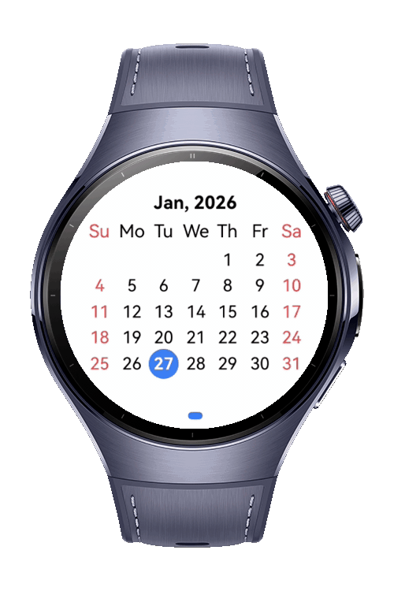
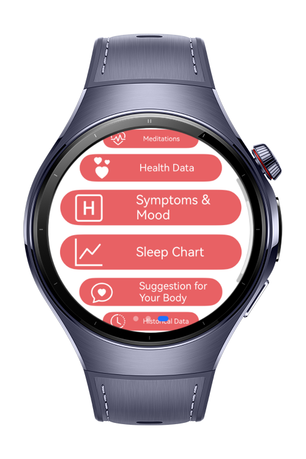
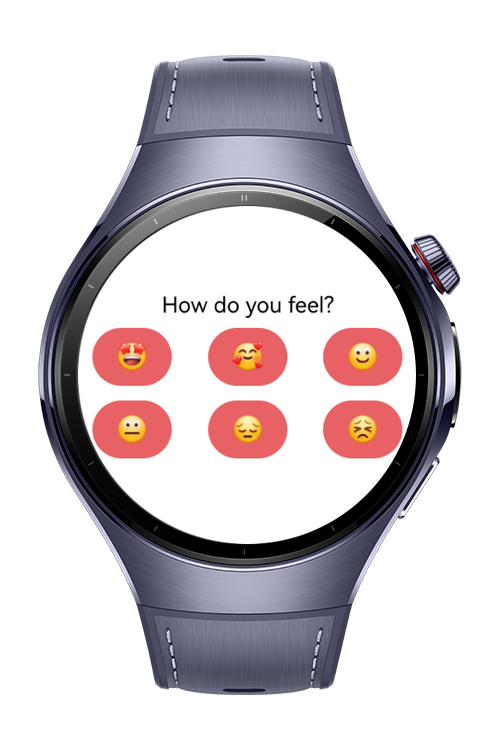
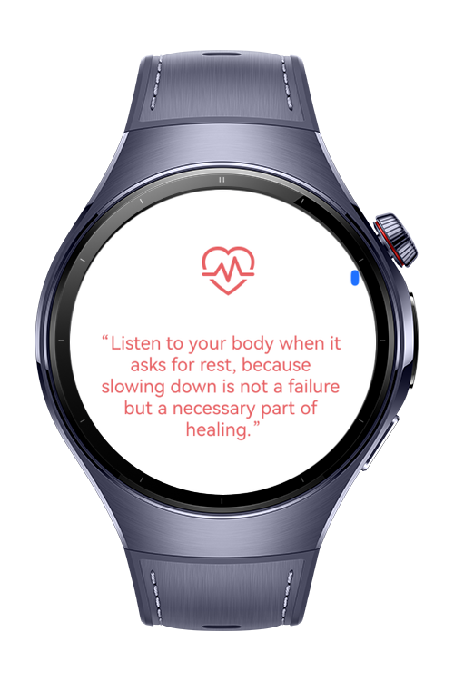

> **Note:** To access all shared projects, get information about environment setup, and view other guides, please visit [Explore-In-HMOS-Wearable Index](https://github.com/Explore-In-HMOS-Wearable/hmos-index).

# Flowear
A health application that offers period tracking, mood checking and personalized health recommendations based on your mood. Helping you better understand your body and emotional state.
It supports a more informed and mindful daily routine.

# Preview

<div>
  
  
  
  
</div>

# Use Cases

- Mark your period day and follow next months
- Fill in the little survey to analyze your mood and symptoms
- Check meditation page for suggested actions based on your mood
- Check hourly health data for today's status
- Follow your sleep routine divided as deep sleep - light sleep - awake
- Read suggestions about importance of body health
- Check your monthly health data and compare your illness data with other weeks

# Technology

## Stack (Languages, Frameworks, Tools, Libraries, *3rd Party)

- **Languages**: ArkTS, ArkUI
- **Frameworks**: Framework: ArkUI (HarmonyOS NEXT)
- **Tools**: DevEco Studio Version 5.1.0 (API 18)
- **Libraries**:
    - `@kit.ArkUI`
    - `@kit.AbilityKit`
    - `@kit.BasicServicesKit`
    - `@kit.PerformanceAnalysisKit`
    - `@mui/dayjs`
    - `dayjs`
    - `@iakii/icons`
    - `@ibestservices/ucharts`

## Required Permissions
- ohos.permission.INTERNET
- ohos.permission.READ_HEALTH_DATA

# Directory Structure

```
entry/
├── src/main/ets/
│ ├── common/
│ │ ├── APIConstants.ets
│ │ ├── ProcessRespTask.ets
│ │ └── RouteConstants.ets
│ │
│ ├── components/
│ │ ├── BreathExercise.ets
│ │ ├── ButtonComponent.ets
│ │ ├── HealthDataComponent.ets
│ │ ├── HistoryComponent.ets
│ │ ├── MoodQuestionComponent.ets
│ │ └── StretchExercise.ets
│ │
│ ├── datasource/
│ │ ├── MeditationDataSource.ets
│ │ ├── StretchDataSource.ets
│ │ └── SymptomsMoodQuestions.ets
│ │
│ ├── entryability/
│ │ └── EntryAbility.ets
│ │
│ ├── entrybackupability/
│ │ └── EntryBackupAbility.ets
│ │
│ ├── lib/
│ │ ├── constants.ets
│ │ ├── types.ets
│ │ └── utils.ets
│ │
│ ├── model/
│ │ ├── MeditationModel.ets
│ │ ├── Model.ets
│ │ ├── StretchModel.ets
│ │ ├── SuggestionBodyModel.ets
│ │ ├── SymptomQuestionModel.ets
│ │ └── TokenResponse.ets
│ │
│ ├── pages/
│ │ ├── CalendarView.ets
│ │ ├── HealthDataPaga.ets
│ │ ├── HistoryPage.ets
│ │ ├── HomePage.ets
│ │ ├── Index.ets
│ │ ├── LoginPage.ets
│ │ ├── ManualLoginPage.ets
│ │ ├── MeditationPage.ets
│ │ ├── SleepChartPage.ets
│ │ ├── SuggestionBodyPage.ets
│ │ ├── SymptomsMoodPage.ets
│ │ └── YearMonthSelector.ets
│ │
│ ├── services/
│ │ ├── CycleManager.ets
│ │ ├── EventManager.ets
│ │ ├── GlobalContext.ets
│ │ ├── ListDataSource.ets
│ │ ├── storage.ets
│ │ ├── YearDataSource.ets
│ │ └── YearItem.ets
│ │
│ ├── viewmodel/
│   ├── HealthDataViewModel.ets
│   ├── LoginViewModel.ets
│   ├── ManualLoginViewModel.ets
│   ├── MeditationViewModel.ets
│   └── SymptomsMoodViewModel.ets
```

# Constraints and Restrictions

## Supported Devices

* Huawei Watch 5

* DevEco Studio Simulator

# License (MIT)

Flowear is distributed under the terms of the MIT License. See the [LICENSE](./LICENSE) for more information.